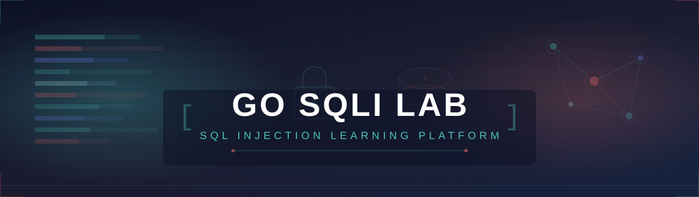
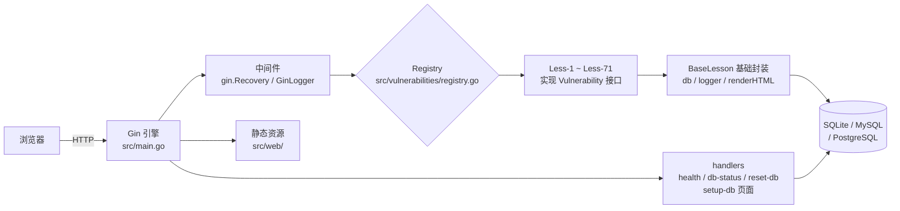

<div align="center">
  
</div>

# Go SQLi Lab

[](https://golang.org)
[](LICENSE)

一个基于 Go 语言实现的 SQL 注入学习平台，参考经典的 [sqli-labs](https://github.com/Audi-1/sqli-labs) 项目构建。

## 🎯 项目简介

Go SQLi Lab 是一个用于学习和测试 SQL 注入漏洞的 Web 应用程序，包含 **71 个关卡（Less-1 ~ Less-71）**，从基础的 Error-based 注入延伸到文件导出注入、文件上传注入等贴近真实业务场景的类型，并覆盖多种 WAF 绕过技术。所有页面均为动态渲染，关卡以注册表模式（Registry）模块化挂载，便于二次开发与扩展。

### 主要特性

- 🔒 **71 个 SQL 注入关卡** - Less-1 ~ Less-71，覆盖完整学习路径
- 🗄️ **多数据库支持** - SQLite（默认，纯 Go 免 CGO）、MySQL、PostgreSQL，建表/清表/占位符自动方言适配
- 📝 **多种注入类型** - 报错注入、布尔盲注、时间盲注、双查询注入、堆叠注入、ORDER BY/LIMIT 注入、二次注入
- 📨 **多入口注入** - GET、POST 表单、Cookie（明文/Base64）、User-Agent / Referer 请求头、JSON 参数
- 🛡️ **WAF 绕过专题** - 注释符过滤、OR/AND 过滤、UNION/SELECT 过滤、空格过滤、addslashes() 模拟等
- 📥 **文件导出/上传注入** - Less-66~69 导出 XLS/XLSX（含"应聘人员求职登记表"简历场景）；Less-70/71 上传 Excel 批量验证注入
- 🏆 **挑战关卡** - Less-54~65 基于独立 challenge1~12 表的综合挑战
- 📊 **模块化设计** - `Vulnerability` 接口 + 注册表，新增关卡只需 1 个文件 + 1 行注册
- 🔄 **一键初始化/重置** - `--setup-db` 参数、`/setup-db` 页面、`POST /api/reset-db` AJAX 接口
- 📝 **完整日志系统** - 结构化滚动日志（lumberjack），HTTP 请求级中间件日志，关卡请求记录到 `tmp/`
- 🎨 **现代化前端** - 原生 HTML/CSS/JS，深色主题与分类配色，无框架依赖
- 📦 **跨平台启动** - Windows/macOS/Linux 一键启动脚本，程序自动定位项目根目录

## 🚀 快速开始

### 环境要求

- **Go 1.25 或更高版本**（由 [go.mod](go.mod) 的 `go 1.25.0` 指令指定；旧版本无法编译）
- SQLite（默认，嵌入式，无需额外安装）
- 或 MySQL / PostgreSQL（可选）

### 方式一：源码运行

```bash
git clone https://github.com/yourusername/go-sqli-lab.git   # 请替换为实际仓库地址
cd go-sqli-lab

# 安装依赖
go mod tidy

# 初始化数据库（迁移 + 种子数据，幂等）
go run src/main.go --setup-db

# 启动服务
go run src/main.go
```

打开浏览器访问 <http://localhost:8080>。

### 方式二：使用 Makefile

```bash
make setup-db   # 初始化数据库
make run        # 启动服务（go run）
make build      # 编译二进制到 bin/
make test       # 运行测试
```

完整命令见 [Makefile](Makefile)（`make help` 可查看全部目标）。

### 方式三：一键启动脚本（推荐）

仓库提供三个平台的启动脚本，会自动 **编译 → 初始化数据库（幂等）→ 启动服务并打开浏览器**：

| 平台 | 脚本 | 用法 |
|------|------|------|
| Windows | [scripts/start-windows.bat](scripts/start-windows.bat) | 双击运行，或在命令行执行 |
| macOS | [scripts/start-macos.command](scripts/start-macos.command) | 双击运行（首次需 `chmod +x scripts/start-macos.command`） |
| Linux | [scripts/start-linux.sh](scripts/start-linux.sh) | `./scripts/start-linux.sh` |

> 设置环境变量 `SQLI_LAB_NO_BROWSER=1` 可禁止脚本自动打开浏览器。

### 方式四：预编译二进制

`bin/` 目录可直接存放编译产物（如 `bin/go-sqli-lab.exe`）。程序启动时会自动定位项目根目录（`go.mod` + `config/app.yaml` 所在目录）并切换工作目录，因此从 `bin/` 或其他目录直接运行二进制均可：

```bash
# Linux/macOS
./bin/go-sqli-lab --setup-db   # 首次运行先初始化数据库
./bin/go-sqli-lab

# Windows
bin\go-sqli-lab.exe --setup-db
bin\go-sqli-lab.exe
```

## 🏗️ 架构图



**请求链路**：浏览器请求 `/less/less-N` → Gin 路由分发 → 注册表中的对应关卡 `Route()` 处理器 → 使用 `BaseLesson` 提供的 `db` 接口执行 **存在漏洞的拼接 SQL** → 渲染结果页面并记录请求到 `tmp/less-N/result.txt`。

## 📁 项目结构

```
go-sqli-lab/
├── src/                        # Go 源代码
│   ├── main.go                # 程序入口：参数解析、项目根定位、路由注册
│   ├── config/                # 配置加载（config.go：YAML + 环境变量覆盖）
│   ├── db/                    # 数据库层（db.go：连接/迁移/种子/重置，多方言适配）
│   │   ├── db_test.go         # 多数据库集成测试（SQLite/MySQL/PostgreSQL）
│   │   └── test_data/         # 测试用数据库文件
│   ├── handlers/              # HTTP 处理器（health/db-status/reset-db/setup 页面）
│   ├── logger/                # 日志系统（logger.go + gin.go 中间件）
│   ├── models/                # 数据模型（User/Email/UAgent/Referer）
│   ├── vulnerabilities/       # 漏洞实现（Less-1 ~ Less-71，71 个 lessN.go）
│   │   ├── vulnerability.go   # Vulnerability 接口
│   │   ├── registry.go        # 关卡注册表（registerLessN 调用 + 路由挂载 + 列表 API）
│   │   ├── base.go            # BaseLesson：db/logger 注入、renderHTML、logRequest
│   │   ├── export.go          # Less-66/67 共享：导出查询 + XLS/XLSX 生成
│   │   ├── resume_export.go   # Less-68/69 共享：简历模板驱动导出（excelize）
│   │   ├── upload.go          # Less-70/71 共享：Excel 解析 + 批量验证
│   │   └── assets/            # go:embed 嵌入的模板文件（简历/上传模板）
│   └── web/                   # 静态资源与页面
│       ├── index.html         # 首页（71 个关卡入口，按 7 大分类）
│       ├── loading.html       # 数据库重置进度页
│       ├── setup_success.html # 初始化/重置成功页
│       ├── setup_error.html   # 初始化/重置失败页
│       ├── css/               # style.css（主样式，含分类配色）/ common.css
│       ├── assets/            # SVG 横幅等
│       └── less-1/ ~ less-65/ # 各关卡的静态资源目录（Less-66+ 页面完全动态渲染）
├── config/                    # 配置文件
│   └── app.yaml               # 服务器/数据库/日志配置
├── scripts/                   # 跨平台一键启动脚本
│   ├── start-windows.bat
│   ├── start-macos.command
│   └── start-linux.sh
├── bin/                       # 编译产物目录
├── data/                      # SQLite 数据库文件（sqli_lab.db）
├── logs/                      # 滚动日志（app.log）
├── tmp/                       # 关卡请求记录（less-N/result.txt）等临时文件
├── doc/                       # 文档：installation / usage / development
├── tools/genresume/           # 简历 XLSX 模板生成工具
├── ref/sqli-labs/             # 参考项目（Git Submodule，只读！）
├── Makefile                   # build/run/test/fmt/vet/clean 等目标
└── .github/workflows/ci.yml   # CI：SQLite/MySQL/PostgreSQL 测试 + golangci-lint
```

### 📦 Git 子模块说明

本项目使用 Git 子模块管理参考项目 `ref/sqli-labs/`：

- **路径**: `ref/sqli-labs/`，**来源**: <https://github.com/Audi-1/sqli-labs>
- **用途**: 原始 PHP 实现参考，用于对照理解漏洞模式
- **权限**: **只读**，禁止修改/删除/新增其中任何文件

```bash
# 克隆时包含子模块
git clone --recursive https://github.com/yourusername/go-sqli-lab.git

# 已克隆但缺少子模块内容时
git submodule update --init --recursive

# 同步上游更新（仅当上游变更时）
git submodule update --init --remote ref/sqli-labs
```

## ⚙️ 配置说明

配置文件位于 `config/app.yaml`：

```yaml
server:
  host: 0.0.0.0
  port: 8080
  mode: debug  # debug 或 release

database:
  type: sqlite  # sqlite, mysql, postgres
  dsn: ./data/sqli_lab.db  # SQLite 数据库路径
  # MySQL/PostgreSQL 配置（type 非 sqlite 时使用）
  host: localhost
  port: 3306
  user: root
  password: ""
  dbname: security
  sslmode: disable  # PostgreSQL 使用

log:
  level: info      # debug, info, warn, error
  format: "[%timestamp%] [%level%] [GID:%goroutine%] [%module%] [%function%] [%file%:%line%] - %message%"
  output: file     # file 或 stdout
  filepath: ./logs/app.log
  maxsize: 100     # 单文件最大 MB
  maxbackups: 10   # 最大备份数
  maxage: 30       # 保留天数
  compress: true   # 备份压缩
```

### 环境变量覆盖

加载优先级：**内置默认值 < `app.yaml` < 环境变量**。支持以下环境变量：

| 环境变量 | 说明 |
|---------|------|
| `SQLI_LAB_HOST` | 监听地址 |
| `SQLI_LAB_PORT` | 监听端口 |
| `SQLI_LAB_MODE` | Gin 运行模式（debug/release） |
| `SQLI_LAB_DB_TYPE` | 数据库类型（sqlite/mysql/postgres） |
| `SQLI_LAB_DB_DSN` | SQLite 文件路径（DSN） |
| `SQLI_LAB_DB_HOST` / `SQLI_LAB_DB_PORT` | 数据库主机/端口 |
| `SQLI_LAB_DB_USER` / `SQLI_LAB_DB_PASSWORD` | 数据库账号密码 |
| `SQLI_LAB_DB_NAME` | 数据库名 |
| `SQLI_LAB_LOG_LEVEL` | 日志级别 |
| `SQLI_LAB_LOG_FILE` | 日志文件路径 |

## 🧰 技术栈

| 类别 | 技术 | 说明 |
|------|------|------|
| 语言 | Go 1.25 | `go.mod` 指定 `go 1.25.0` |
| Web 框架 | [Gin](https://github.com/gin-gonic/gin) v1.12.0 | 路由、中间件、模板 |
| SQLite | [modernc.org/sqlite](https://pkg.go.dev/modernc.org/sqlite) v1.48.0 | 纯 Go 实现，无 CGO，默认数据库 |
| MySQL | [go-sql-driver/mysql](https://github.com/go-sql-driver/mysql) v1.9.3 | 驱动 |
| PostgreSQL | [lib/pq](https://github.com/lib/pq) v1.12.2 | 驱动 |
| Excel 处理 | [excelize/v2](https://github.com/xuri/excelize) v2.11.0 | .xlsx 解析/模板填充/生成 |
| Excel 处理 | [extrame/xls](https://github.com/extrame/xls) | 二进制 .xls 解析（Less-70） |
| 日志滚动 | [lumberjack.v2](https://gopkg.in/natefinch/lumberjack.v2) v2.2.1 | 按大小滚动、压缩、保留策略 |
| 配置解析 | [yaml.v3](https://gopkg.in/yaml.v3) | 应用配置 |
| 前端 | 原生 HTML/CSS/JS | 无框架，深色主题 + 分类配色 |
| CI | GitHub Actions | SQLite/MySQL/PostgreSQL 集成测试 + golangci-lint |

## 🗺️ 关卡地图（Less-1 ~ Less-71）

| 分类 | 关卡 | 说明 |
|------|------|------|
| **📚 基础挑战** | Less-1 ~ Less-10 | 报错注入（字符串/整数/括号/双引号）、双查询注入、INTO OUTFILE 主题、布尔盲注、时间盲注 |
| **📝 POST/Header/Cookie** | Less-11 ~ Less-22 | POST 登录注入、UPDATE 注入、User-Agent / Referer 头注入、Cookie 注入（明文与 Base64） |
| **🛡️ WAF 绕过** | Less-23 ~ Less-37 | 注释过滤、二次注入、OR/AND 过滤、空格/注释过滤、UNION/SELECT 过滤、addslashes()/宽字节主题、POST 与整数变体 |
| **📚 堆叠/高级子句** | Less-38 ~ Less-53 | 堆叠查询（GET/POST）、ORDER BY 注入（含盲注/报错/字符串/堆叠变体）、LIMIT 子句注入 |
| **🏆 挑战关卡** | Less-54 ~ Less-65 | challenge1~12 独立表：UNION、报错盲注、时间盲注、布尔盲注、堆叠、WAF、JSON 参数、纯整数、括号、Cookie、UA |
| **📤 文件导出注入** | Less-66 ~ Less-69 | 导出 XLS/XLSX 时 keyword 拼接注入；Less-68/69 为"应聘人员求职登记表"简历导出场景 |
| **📥 文件上传注入** | Less-70 ~ Less-71 | 上传 XLS/XLSX 文件，后端解析单元格内容批量执行注入验证 |

## 📝 使用示例

> 所有关卡均需要先初始化数据库（`--setup-db` 或访问 `/setup-db`）。首页每个关卡入口自带 `?id=1` 示例参数，直接点击即可开始。
> 挑战关卡（Less-54~65）的 `challenge1~12` 表数据在“重置数据库”时注入，首次练习前请先在首页点击 **🔄 重置数据库**（详见 [doc/usage.md](doc/usage.md) 第 5 章）。

### GET 报错注入（Less-1，字符型）

```text
# 正常请求 → 显示 Dumb 用户
http://localhost:8080/less/less-1?id=1

# 注入单引号 → 页面显示 SQL 语法错误（报错注入特征）
http://localhost:8080/less/less-1?id=1'

# UNION 注入（先闭合引号与注释，用不存在的 id 使 UNION 行成为首行）
http://localhost:8080/less/less-1?id=99' UNION SELECT 1,2,3-- -
```

### POST 登录注入（Less-11，字符型）

访问 <http://localhost:8080/less/less-11>，提交：

- Username: `admin' OR '1'='1`
- Password: 任意内容

### 布尔盲注（Less-8）

```text
# 返回 "You are in..........."（条件为真）
http://localhost:8080/less/less-8?id=1' AND '1'='1

# 空白无回显（条件为假）
http://localhost:8080/less/less-8?id=1' AND '1'='2
```

### 更多场景

各类型注入的详细利用方法（含 Cookie/Header、WAF 绕过、堆叠、挑战、导出/上传注入），请参阅 **[使用说明 doc/usage.md](doc/usage.md)**。

## 🔌 API 端点

| 端点 | 方法 | 说明 |
|------|------|------|
| `/health` | GET | 健康检查 |
| `/api/db-status` | GET | 数据库连接状态 |
| `/api/reset-db` | POST | 重置数据库（清空并重新种入全部表） |
| `/api/vulnerabilities` | GET | 关卡列表（id/name/description/category） |
| `/api/vulnerabilities/:id` | GET | 单个关卡信息 |
| `/setup-db` | GET | 页面初始化数据库（`?reset=true` 为重置） |
| `/setup-success` / `/setup-error` | GET | 初始化结果页 |
| `/loading` | GET | 重置进度页 |
| `/less/less-N` | GET/POST | 各关卡入口（N = 1 ~ 71） |

数据库重置也可通过首页右上角 **🔄 重置数据库** 按钮触发（带确认与进度页）。

## 🔧 开发文档

- 开发环境、添加新关卡完整流程、数据库/日志/配置最佳实践 → [doc/development.md](doc/development.md)
- 新增关卡的核心步骤：

1. 在 `src/vulnerabilities/` 新建 `lessN.go`，实现 `Vulnerability` 接口（`ID/Name/Description/Category/Route`），通常内嵌 `BaseLesson` 复用 `db`/`logger` 与渲染方法；
2. 在 `registry.go` 的 `RegisterAll()` 中追加 `r.registerLessN()` 注册；
3. 在 `src/web/index.html` 对应分类区块加入口链接，并在 `src/web/css/style.css` 添加 `category-*` 配色；
4. 同步更新关卡总览（README/usage）与 CHANGELOG。

## ⚠️ 免责声明

**本平台仅供学习和研究使用！**

1. 请勿在未经授权的系统上使用本工具
2. 请勿用于非法用途或恶意攻击
3. 使用本平台造成的任何后果由使用者自行承担
4. 请在合法的环境和授权下进行测试

详见 [DISCLAIMER.md](DISCLAIMER.md)

## 📄 开源协议

本项目采用 [MIT 协议](LICENSE) 开源。

## 🙏 致谢

- 感谢 [sqli-labs](https://github.com/Audi-1/sqli-labs) 项目提供的灵感与参考实现
- 感谢所有贡献者和安全研究人员

## 📞 联系我们

- GitHub Issues: [提交问题](https://github.com/yourusername/go-sqli-lab/issues)（请替换为实际仓库地址）

---

**⚠️ 重要提示: 请合法使用，切勿用于非法用途！**
